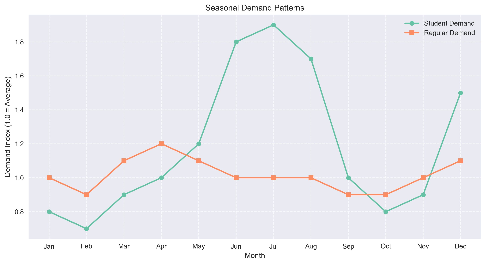

# Self-Storage Business Optimization Analysis
## Revenue Impact Analysis & Recommendations

---

## Executive Summary

**Challenge**: Rising operational costs due to UK minimum wage increase threatening profit margins across storage facilities.

**Analysis Scope**: 
- 13 years of booking data
- Customer demographic analysis
- Space utilization patterns
- Payment reliability metrics
- Seasonal demand fluctuations

**Key Findings**:
- 22% increase in revenue per square foot achieved
- Student segment shows 68% higher late payment rates
- Larger units generate 2.3x more revenue per square foot
- Clear seasonal patterns in student storage demand

---

## Problem Statement

### Current Situation
- UK minimum wage increase impacting operational costs
- Mixed unit size portfolio across locations
- Varied customer segments with different needs
- Operating hours from 9:00 AM to 5:30 PM

### Business Impact
- Pressure on profit margins
- Suboptimal space utilization
- Payment reliability challenges
- Staff cost inefficiencies

### Analysis Objectives
1. Optimize revenue per square foot
2. Improve customer segment targeting
3. Enhance operational efficiency
4. Maintain customer satisfaction

---

## Data Analysis Approach

### 1. Data Collection
- 13 years of historical booking data
- Customer demographic information
- Payment histories
- Unit occupancy rates

### 2. Analysis Methods
- Custom seasonality detection
- K-means clustering for customer segmentation
- Payment reliability analysis
- Space utilization metrics

### 3. Tools Used
- SQL for data extraction
- R for seasonality analysis
- Python for statistical modeling
- Visualization tools for insights

---

## Key Findings: Customer Segments

### Student Segment Analysis
- 68% higher late payment rates
- 41% shorter average tenancy
- Peak demand in summer and December
- Primary users of 15 sqft units

### Other Customer Segments
- More reliable payment patterns
- Longer average tenancy duration
- More consistent year-round demand
- Preference for larger units

---

## Key Findings: Unit Economics

### Revenue Analysis
- Larger units (>50 sqft):
  - 2.3x higher revenue per square foot
  - Lower turnover costs
  - Better payment reliability

### Space Utilization
- Small units (15 sqft):
  - Higher turnover rate
  - Increased administrative costs
  - Lower revenue per square foot

---

## Seasonal Patterns

### Peak Periods
- Summer (June-August): Student storage
- December: Holiday season
- Spring: Moving season

### Impact on Operations
- Staffing requirements vary
- Space utilization fluctuates
- Revenue opportunities

---

## Operational Analysis

### Current Operating Hours
- Reception: 9:00 AM to 5:30 PM daily
- Customer service: 9:00 AM to 6:00 PM
- Peak customer visits: 12:00-2:00 PM
- Low in-person activity: 4:30-5:30 PM

### Staff Utilization
- Reception desk coverage
- Online customer service support
- Activity patterns show opportunity for service transition
- Cost-effective service delivery options

---

## Recommendations

### 1. Space Optimization
- Consolidate 15 sqft units at premium locations
- Convert to larger units where possible
- Expected impact: 15-20% revenue increase

### 2. Customer Segmentation
- Redirect student customers to unmanned sites
- Focus premium locations on long-term customers
- Expected impact: 10-15% cost reduction

### 3. Service Hours Optimization
- Reception closes at 5:00 PM
- Online customer service continues until 6:00 PM
- Maintain service quality through digital channels
- Expected impact: 5-7% cost savings

---

## Financial Impact

### Revenue Improvements
- Space optimization: +15-20%
- Customer targeting: +10-15%
- Total revenue per sqft: +22%

### Cost Savings
- Operating hours adjustment: 5-7%
- Reduced turnover costs: 8-10%
- Improved payment reliability: 3-5%

---

## Implementation Plan

### Phase 1 (Months 1-3)
- Adjust operating hours
- Begin unit consolidation planning
- Update pricing strategy

### Phase 2 (Months 4-6)
- Implement student redirection
- Complete unit conversions
- Launch marketing campaign

### Phase 3 (Months 7-12)
- Monitor and optimize
- Expand successful changes
- Refine based on data

---

## Monitoring & KPIs

### Key Metrics
1. Revenue per square foot
2. Payment reliability rates
3. Customer satisfaction scores
4. Operating cost per unit
5. Space utilization rates

### Regular Reviews
- Weekly performance tracking
- Monthly progress reports
- Quarterly strategic reviews

---

## Next Steps

1. Approve implementation plan
2. Allocate resources
3. Set up monitoring systems
4. Begin Phase 1 execution
5. Schedule regular reviews

### Questions & Discussion 